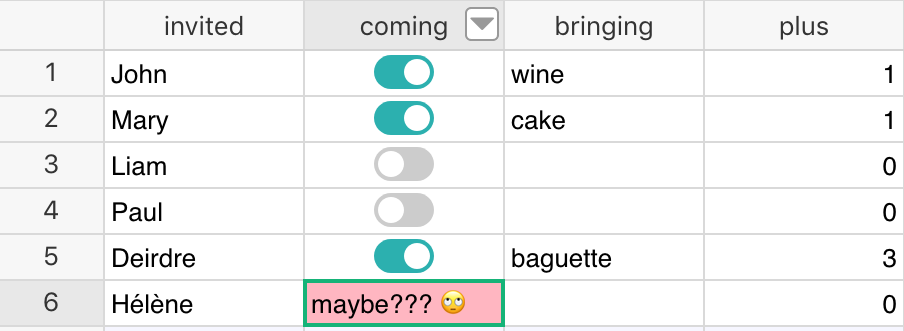

Columns and data types
======================

Every Grist table, when first created, has three columns called A, B, and C.
To rename a column, hover on the column header, click on the drop-down, then
select "Rename column" (you can also just click on the column header twice).

To delete a column, hover on the column header, click on the drop-down, then
select "Delete column".

To add a column, click on the "+" symbol in the header row, then type in
the column name.

**
{: .screenshot-half }

To reorder a column, first select the column if it isn't already selected,
by clicking on the column header.  Next, click and hold on the column header.
After a second or two, you'll be able to drag the entire column to its new
location.

Another way to reorder columns is via the widget options:

In the visible columns section, the columns can be dragged around freely to
reorder them.  You can also hide columns here.

**
{: .screenshot-half }

Specifying a type
-----------------

Grist columns have types, similar to other spreadsheets or databases.  The type of a column
controls its appearance and the help Grist will offer you when editing cells.

When you create a new column, it initially has the `Any` type.  When you enter the column's
first cell, Grist tries to narrow this type.  If you enter a number, the column will
be changed to `Numeric` type, which is right-aligned by default.  If you enter something
that doesn't look like text, the column will be changed to `Text` type, which is left-aligned
by default.

To inspect the type of a column, hover over the column header, then click on the drop-down,
then select "Column Options".  The "Column Type" section is what you are looking for.

You will often want to control the column type manually.  You can change it in the "Column Type"
section.  For example, here we set a column full of "yes" and "no" responses to be of type
`Toggle`:

One advantage of doing so is that Grist can now offer you ways to visualize the column that
are specialized to on/off style values.  Each column type has different options in the
"Cell Format" section of the side panel:

Regardless of the column type, you can enter **any value** in cells. If a value entered is
incompatible with the defined type, the cell will be highlighted with an error (and columns
referencing the invalid value will also display an error):

Supported types
---------------
Grist supports the following types:

 <!-- For css styling via css/extra.css -->

Type      | Description
--------- | -----------
Text      | (**Default**) Any string of text.
Numeric   | Floating point numbers.
Integer   | Integers (whole numbers).
Toggle    | Boolean (True / False)
Date      | Valid date (without a time component).
DateTime  | Valid date + time.
Choice    | List of pre-defined valid values.
Reference | A reference column to another table.
Attachment| Cells where you can place files or images.
