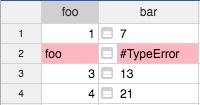
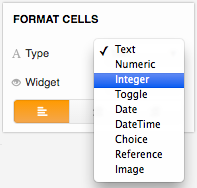

Columns and data types
======================

Overview
--------
Grist columns have types, similar to other spreadsheets or databases, but with a few differences:

1. Columns allow you to enter **any value**, regardless of their type.
   If a value entered is incompatible with the defined type, the cell will be highlighted with an
   error and columns referencing the invalid value will also display an error:
       

Specifying a type
-----------------
The default type for value columns is ``Text``. You can change the column type in **Field Options**
in the Sidepane:

In the column menu drop-down, select ``Field options``:

Then, in the sidebar menu, use the type drop-down to select the appropriate type:

Supported types
---------------
Grist supports the following types:

 <!-- For css styling via css/extra.css -->

Type      | Description
--------- | -----------
Text      | (**Default**) Any string of text.
Numeric   | Floating point numbers.
Integer   | Integers (whole numbers).
Toggle    | Boolean (True / False)
Date      | Valid date (without a time component).
Datetime  | Valid date + time.
Choice    | List of pre-defined valid values.
Reference | A reference column to another table.
Image     | Exactly what it sounds like.
