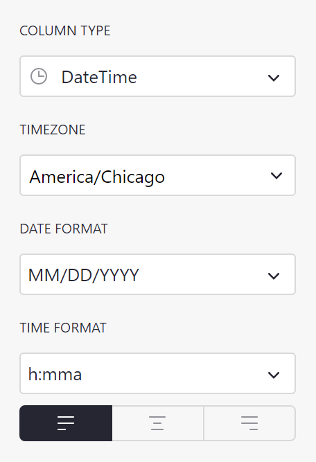
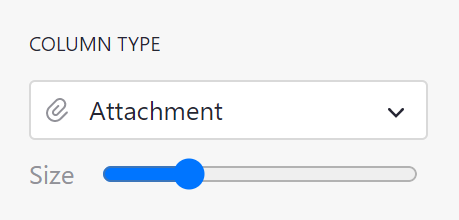

<iframe width="560" height="315" src="https://www.youtube.com/embed/kEKYcW3h4V8?rel=0" frameborder="0" allow="accelerometer; autoplay; encrypted-media; gyroscope; picture-in-picture" allowfullscreen></iframe>

Columns and data types
======================

Adding and removing columns
-------------------------------

Every Grist table, when first created, has three columns called A, B, and C.
To rename a column, hover on the column header, click on the drop-down, then
select "Rename column" (you can also just click on the column header twice).

To delete a column, hover on the column header, click on the drop-down, then
select "Delete column".

To add a column, click on the "+" symbol in the header row, then type in
the column name.

**
{: .screenshot-half }

To reorder a column, first select the column if it isn't already selected,
by clicking on the column header.  Next, click and hold on the column header.
After a second or two, you'll be able to drag the entire column to its new
location.

Another way to reorder columns is via the widget options:

In the visible columns section, the columns can be dragged around freely to
reorder them.  You can also hide columns here.

**
{: .screenshot-half }

Renaming columns
------------------

You can rename columns in several ways.  One way is to
click on the column header when the column is already selected.
Another is to hover on the column
header, click on the drop-down, then select "Rename Column".
Another is by selecting "Column Options" in the same drop-down, and editing the "Field"
name shown at the top.  A bonus with this method is that you can also control
the identifier given to the column
in formulas.  By default this is based on the field name, with any
characters Python doesn't like replaced with "_", and a number added if needed
to keep the name unique within your table.  If you don't like this identifier, you
can change it, though it will still need to be Python-friendly.  To change
the name, deselect "Use Name as ID" if it is selected, and edit the "ID" entry now
shown.

Specifying a type
-----------------

Grist columns have types, similar to other spreadsheets or databases.  The type of a column
controls its appearance and the help Grist will offer you when editing cells.

When you create a new column, it initially has the `Any` type.  When you enter the column's
first cell, Grist tries to narrow this type.  If you enter a number, the column will
be changed to `Numeric` type, which is right-aligned by default.  If you enter something
that doesn't look like text, the column will be changed to `Text` type, which is left-aligned
by default.

To inspect the type of a column, hover over the column header, then click on the drop-down,
then select "Column Options".  The "Column Type" section is what you are looking for.

You will often want to control the column type manually.  You can change it in the "Column Type"
section.  For example, here we set a column full of "yes" and "no" responses to be of type
`Toggle`:

One advantage of doing so is that Grist can now offer you ways to visualize the column that
are specialized to on/off style values.  Each column type has different options in the
"Cell Format" section of the side panel:

Regardless of the column type, you can enter **any value** in cells. If a value entered is
incompatible with the defined type, the cell will be highlighted with an error (and columns
referencing the invalid value will also display an error):

Supported types
---------------
Grist supports the following types:

 <!-- For css styling via css/extra.css -->

Type      | Description
--------- | -----------
Text      | (**Default**) Any string of text.
Numeric   | Floating point numbers.
Integer   | Integers (whole numbers).
Toggle    | Boolean (True / False)
Date      | Valid date (without a time component).
DateTime  | Valid date + time.
Choice    | List of pre-defined valid values.
Reference | A reference column to another table.
Attachment| Cells where you can place files or images.

Text columns
--------------

You can put any text you like in this type of column.  For formatting,
you can control alignment and word-wrap, text color and background color.
If the column is used for storing web links, you can turn on "HyperLink"
formatting to make that prettier.

**
{: .screenshot-half }

Numeric columns
-----------------

This type is for floating point numbers, and can also be used with
whole numbers.  As for text, you can control alignment and color.
You can also choose whether to show arrows for increasing/decreasing
the number (this is the "Spinner" option).  And you can set a
minimum and maximum number of decimal points to show.

**
{: .screenshot-half }

Integer columns
-----------------

This is strictly for whole numbers.  It has the same options as
the numeric type, except no "Max Decimals".

Toggle columns
----------------

This type is for storing true/false values.  The values can be shown
as text, checkboxes, or switches.

**
{: .screenshot-half }

See also example in [Specifying a type](col-types.md#specifying-a-type).

Date columns
----

This type is for storing calendar dates (without a time of day component).
More details in [Working with dates](dates.md).  You can choose the
format for dates, see the [date formatting reference](https://momentjs.com/docs/#/displaying/format/).

**
{: .screenshot-half }

DateTime columns
---------

This type is for storing calendar dates plus time of day.
More details in [Working with dates](dates.md).  You can choose the
format for dates, see the [date and time formatting reference](https://momentjs.com/docs/#/displaying/format/).  You can also specify the timezone to display for.

**
{: .screenshot-half }

Choice columns
-------

This type is for storing one of a set of valid values, where you get to
specify the available values.

**
{: .screenshot-half }

There's an example of using this type of column in
the [Lightweight CRM example](lightweight-crm.md#setting-other-types).

If you start off with a populated text column, Grist will take all unique
values from that column as the valid choices.  You can add or remove choices
as you wish.

Reference columns
----------

This sets up a cross-reference to another table.  You can specify the
table to reference, and a column within that table to show.
There's a lot you can do with this kind of column, see [Reference columns](col-refs.md) for
details.

**
{: .screenshot-half }

Attachment columns
-----------

This column type lets you insert entire files and images in cells.
When images are added in cells, a preview thumbnail is shown in the
cell.  The "Size" bar gives control of the scale of this thumbnail.

**
{: .screenshot-half }

When you create an attachment column, cells of that column will
have a paperclip icon:

When you click on a paperclip icon, you can select a file to attach.
If it is an image, you'll see a thumbnail of it in the cell.

<!-- Source: https://en.wikipedia.org/wiki/File:Red_eyed_tree_frog_edit2.jpg -->

If you hover over the image, you'll see a paperclip icon again,
which you can use to add more files to the same cell.  You'll
also see an "open-eye" icon, which when clicked brings up a
larger view of all of the cell's attachments, and gives you
a way to rename them, download them, or remove them.

