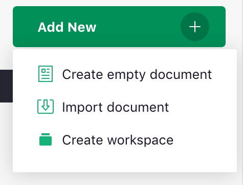

<iframe width="560" height="315" src="https://www.youtube.com/embed/m8Bt6QBHTu4?rel=0" frameborder="0" allow="accelerometer; autoplay; encrypted-media; gyroscope; picture-in-picture" allowFullScreen></iframe>

## Creating a document

To get started with Grist you'll first need to create a document.
Each document can store different kinds of data, so think of it as a
collection of *related* data.

You can start from scratch or import existing data. Click the Add New button on
the home screen and choose either "Create empty document" or "Import document".

**
{: .screenshot-half }

You can import spreadsheets in Excel format, as well as comma-separated value
files or CSVs. If you import a spreadsheet that has multiple tabs, each tab
will become a separate table in Grist.

## Examples and templates

The "Examples &amp; Templates" list on the Grist homepage includes a number of
Grist documents that demonstrate Grist features and use cases. These are always
accessible via a link on the bottom left of the home page.

For each example, there is a corresponding How-To Tutorial in this
documentation, which describes how to use it or how to build such a document
from scratch.

You can open any of the examples in view-only mode, or click "Make own copy"
and select "Copy full document" to get an editable copy.

You can also use any of the examples as a template for a new document, whch
will include the structure, layout, and formulas of the example, but none of
the sample data. Simply Click "Make own copy" and select "Copy as template".

## Importing more data

Once you've created a document, you can import more data into it by opening the
document and selecting "Add New" and then one of the Import options.

*{: .screenshot4}*
{: .screenshot-half }

You can read more about imports data at [Importing more data](imports.md).
