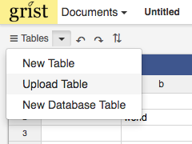

Entering data
-------------
Grist behaves much like other spreadsheet software. You can type into any selected cell. While in
type mode you can take several actions:

 * ``Escape`` key cancels the operation and restores the previous values of the cell.
 * ``Tab`` key saves your entry and moves your cursor to the next cell in the current row.
 * ``Enter`` key saves your entry and moves your cursor to the next cell in the current column.

Cut and pasting
---------------
You can cut and paste data into and out of Grist similar to other spreadsheet programs. If the
pasted range is longer than the available records, additional records will be created.

!!! note "Available in future release"
    If more columns are pasted than available, a prompt will confirm whether you'd like to create
    additional columns or to limit paste to the current ones.

Importing data
--------------
There are several ways to import data into Grist.

### Upload as a new document

From the Document List, click ``Upload Doc`` and select a file. You can import tab-delimited or
comma-delimited files, as well as ``xls(x)`` files. If you're importing a spreadsheet with multiple
tabs, each tab will be imported as a separate table in Grist.

### Import into existing document

From the Tables dropdown menu, select ``Upload Table`` and select a file.

