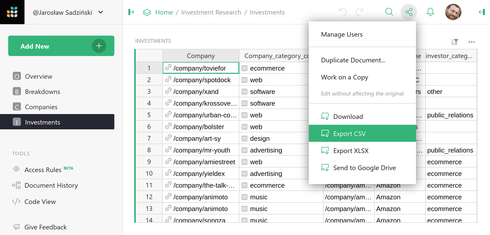

# Exporting

## Exporting a table

If you want to export a table to another spreadsheet or database,
one option is to export that table in CSV format, a common interchange format for data.
To do this, open your document to the desired table.  Then click the sharing icon
()
on the top right of the screen. It opens the menu with sharing and export
options. Select "Export CSV".

Your browser will then download a CSV file containing a header row
naming your columns, excluding any hidden columns, followed by all the
rows of data in the table in text format.

When on a page with multiple page widgets, "Export CSV" will export only the data in the
currently-selected widget.

## Backing up an entire document

Grist documents can also be downloaded in their entirety as an SQLite database
file with a `.grist` extension.  SQLite is a popular database format.
The downloaded file will contain all your tabular data, any attached
files within those tables, metadata about your tables, pages, and
widgets, and a history of recent modifications of the document.  It
will not contain information about who the document is shared with.

To download a Grist document, click the sharing icon
()
on the top right of the screen, and select "Download".

## Restoring from backup

A downloaded `.grist` file can be uploaded again to provide an exact copy of the
original.  To upload the file, open the team or personal site where
you want to place it, and optionally select also a workspace.
Then click on "Add New" in the top left, and select "Import document".

You may also import CSV and Excel files as new Grist documents this way.
