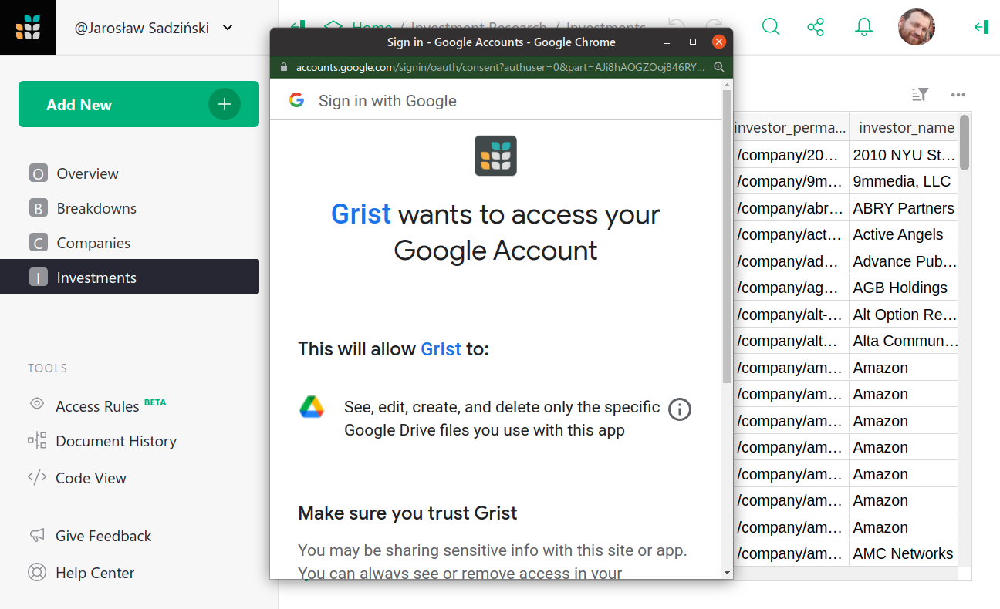

# Exporting

## Exporting a table

If you want to export a table to another spreadsheet or database,
you can export that table as either an XLSX file or a CSV, a common interchange format for data.
To do this, open your document to the desired table or widget. Then click the three dot menu in the top right of the widget. 
Select either "Download as CSV" or "Download as XLSX".

Your browser will then download a file containing a header row
naming your columns, excluding any hidden columns or filtered-out rows, followed by all the
rows of data visible in the table. To export [filtered data](search-sort-filter.md#filtering), make sure to save your filter.

## Exporting a document

If you want to export all tables to Excel format, click the sharing icon
()
on the top right of the screen and select "Export XLSX".

Your browser will then download an Excel file, where each table is a separate sheet
containing all rows, without any filters applied. To use this option you need to have full
read access for all tables in a document.

A note about "Export CSV" in the sharing menu. When on a page with multiple page widgets, "Export CSV" will export only the data in the
currently-selected widget. To export all your data, use "Export XLSX" or the "Download" option which is explained below in [backing up an entire document](exports.md#backing-up-an-entire-document).

## Sending to Google Drive

If you want to export a document to Google Drive as a Google Sheet file, click the
sharing icon ()
on the top right of the screen and select "Send to Google Drive".

Grist will first ask you to log in to your Google Account (or use an account you already
signed in) and then for permission to create a file in your Google Drive. Grist will be
able to create new files and manage them but will not be able to access any other files in
your drive.

Once you accept the permission request, Grist will export your document to an 
[Excel file](exports.md#exporting-a-document) and then save it in your Google Drive as a
Google Sheet file. To use this option, you need to have full read access for all tables in
a document.

## Backing up an entire document

Grist makes regular backups of documents automatically, as described in [Automatic
Backups](automatic-backups.md). You can also make manual backups by [saving
copies](copying-docs.md#copying-for-backup-purposes) of documents in your Grist account.

In addition, Grist documents can be downloaded in their entirety as an SQLite database
file with a `.grist` extension.  SQLite is a popular database format.
The downloaded file will contain all your tabular data, any attached
files within those tables, metadata about your tables, pages, and
widgets, and a history of recent modifications of the document.  It
will not contain information about who the document is shared with.

To download a Grist document, click the sharing icon
()
on the top right of the screen, and select "Download".

## Restoring from backup

A downloaded `.grist` file can be uploaded again to provide an exact copy of the
original.  To upload the file, open the team or personal site where
you want to place it, and optionally select also a workspace.
Then click on "Add New" in the top left, and select "Import document".

You may also import CSV and Excel files as new Grist documents this way.