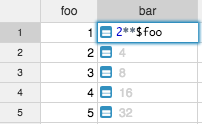
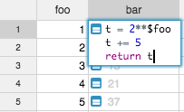

Formulas and scripting
======================

Entering a formula
------------------
Unlike typical spreadsheets, Grist formulas are column-wide. This means that a single formulas
applies to the whole column—you don't have to worry about filling it in for all rows.

To enter a formula into a cell, enter the equal sign ``=`` followed by a python expression.

For example, here we entered an expression ``=2**$foo`` which raises 2 to the power specified in
column ``foo``:

Multi-line formulas
-------------------
Python is a wonderful and powerful language, and it's a shame to constrict it to a single line in a
cell. So Grist doesn't! You can use multiline complex Python expressions for any formulas column.

**In a cell** you can use ``Shift+Enter`` to move the cursor to the next line:

You can also enter your formula **in the sidebar**, where ``Enter`` gives you a new line
automatically:

Paste as values
---------------
If you'd like to save the output of your formula as plain values, you can simply turn off the
formula by clicking on the formula icon in the sidebar:  ➔ :

You'll also notice that the column is no longer a formula by the absense of the leading ``=`` sign
next to each value.

!!! tip "Use the values, keep your formula"
    Note that you don't lose your formula by turning it off. The formula itself remains and you can
    turn it back on. If you modified the values in the column, however, they will be recalculated by
    the formula. You can always undo to revert back to the previous state.
