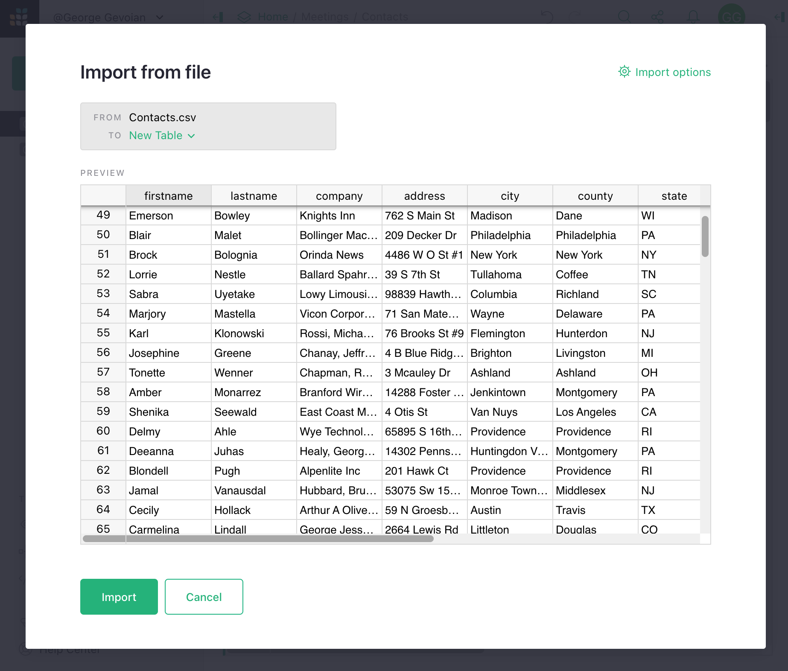
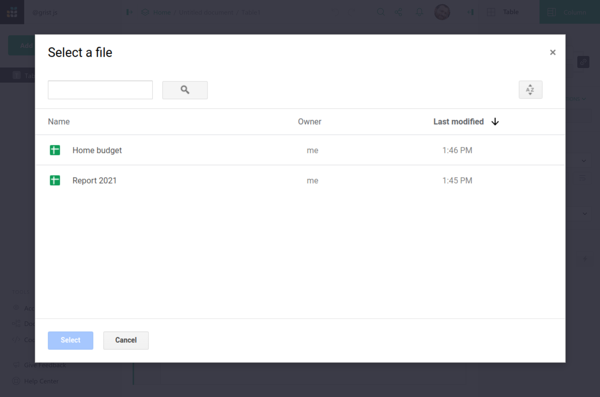
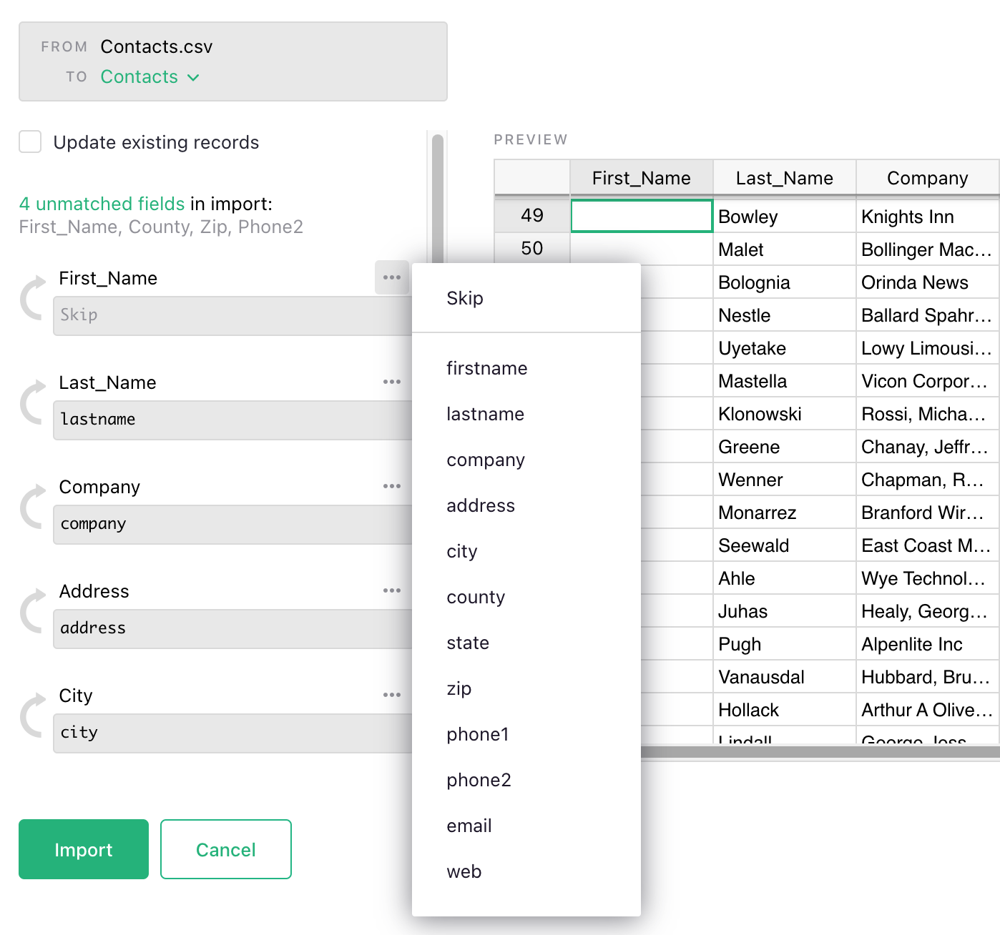
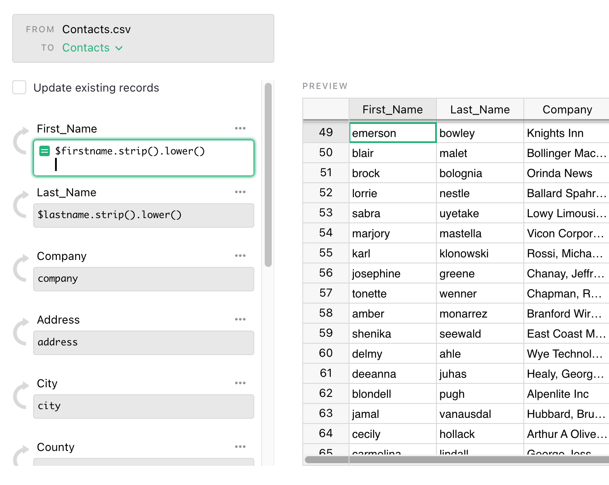

# Importing more data

You can import a file to [start a new Grist document](creating-doc.md), or to
add data to an existing document. Grist supports imports of Excel, CSV, JSON,
tab-separated files and from [Google Drive](imports.md#import-from-google-drive).

To start a new Grist document, click the "Add New" button on the home screen
and choose "Import document", as described in [starting a new Grist document](creating-doc.md).

To add to an existing document, open that document, click the "Add
New" button and then "Import from file".  By default, each imported
table is added as a new Grist table, but when examining the preview
dialog for an import, you have an option to change the destination to
an existing Grist table.

You can also import any of the same formats from a URL, using the "Import from URL" option.

## The Import dialog

When you import data into an existing document, Grist opens an import dialog to
show you what will be imported. This dialog offers available import options,
lets you choose whether to create a new table or add to an existing one, and
shows a preview of the data.

The "Import options" link on the top right is sometimes useful when importing
delimited files. Grist guesses the settings to parse the data (such as the
field delimiter), but if it guesses incorrectly, you can adjust the settings.

## Guessing data structure

In all cases, when you import a file, Grist makes guesses about the structure of the file.

For Excel files, Grist treats each sheet as a separated table. For CSV and
other delimited formats, one file becomes one table. For both Excel and
delimited files, Grist tries to detect whether the headers are included and
which line they occur in. If Grist detects there are no headers, it will name
columns as "A", "B", "C", etc.

Grist automatically tries to parse numbers, dates, and boolean fields to detect
the most suitable type for each column. It tries to be lossless: e.g. if it
marks a column as numeric, any text values in it (such as "N/A") will remain in
the imported table, but will be highlighted due to the type mismatch.

You can always rename tables and columns after an import, as well as convert types.

## Import from Google Drive

Importing from a Google Drive is as easy as importing from an Excel file or a 
CSV file. You can either provide an URL of a file stored in the Google Drive or
use a Google File Picker to choose a file from your own drive.

To use a Picker, click the "Add New" button and choose "Import from Google 
Drive".

To import, sign in to your Google Account by clicking the "Sign in" button and
following the sign-in process. Grist will ask for a permission to read the file
you will import from Google Drive. We won't read any other files on your
drive — just the single file you choose to import.

Once the file has been chosen, the rest of the process is the same as importing 
from an Excel file. In the [import dialog](imports.md#the-import-dialog) 
you may configure what data to import, and which destination table to add it to.

If you have an URL to a file or a spreadsheet stored on your Google Drive or a file that
is publicly accessible, you can import it directly using the "Import from URL" option from
the "Add New" menu.

If the file is not shared publicly, Grist will ask you for permission
to read files from your Google Drive. If you don't want to allow Grist to read your files,
it will open up Google File Picker where you can select the file you want to import.

## Import to an existing table

By default, Grist imports new data as new tables, but the Import dialog allows
you to change the destination and import data into an existing table.

When importing to an existing table, Grist will attempt to match the columns
from your imported file to the columns in the destination table. To manually
specify column matching, click the "three dots" button to open a menu with a
list of columns from your imported file. Click on a column name to match it
to a destination column, or select 'Skip' to skip importing data from that column.

You can also specify a formula for each imported column by clicking the gray
source column field to open a formula editor. Formulas can reference
one or more imported columns, and the result of evaluating the formula will
be shown in the preview after closing the editor.

Importing to an existing table is best suited for importing multiple datasets
containing similar structure. For instance, you could import a bank statement as a
new table, then import more statements from other months into the same table.

For developers, the [Grist API](rest-api.md) offers a more powerful way to add data
to a Grist document.

## Updating existing records

Suppose the table we are importing to already contains some of the data in our
file. We'd like Grist to update these existing records rather than duplicate
them.

We can tell Grist to update these records by checking the "Update existing records"
option, and specifying which fields to use for matching incoming data against
existing records.

{: .screenshot-half }

An imported row and an existing record that have the same values for all of the
selected merge fields are considered the same record. In this case, importing
will update the fields of the record with the imported data. Blank values
from the imported data will be skipped, leaving the corresponding fields in
the original record unchanged.

!!! tip ""
    **Note:** If there are multiple imported rows that have the same values for the
              selected merge fields, the last row will be used for matching and updating.
              If there are multiple existing records that have the same values for
              the selected merge fields, only the first record will be updated if a
              matching imported row is found.

Each time the merge fields are changed, Grist will generate a preview of the updates that
will be made to the destination table, and display them in the preview table.

Changes are highlighted as follows:

 - New records have all of their fields highlighted in green.
 - Updated records have red and green highlighting for any changed fields: red (with a
   strikethrough) for existing values from the destination, and green for new
   values from the imported file.
 - Unchanged records have no highlighting. Field values that exist in the destination table,
   but are blank in the imported file, are distinguished by a light gray font color.
