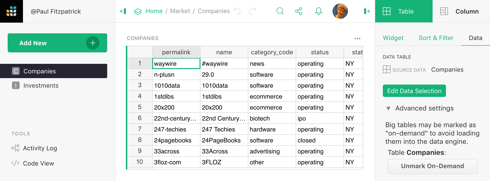

# On-Demand Tables

!!! warning "On-demand tables are an experimental feature"
    The design of on-demand tables may change.  For example,
    configuration options may be added, or aspects of the behavior of
    on-demand tables may be changed entirely.

A defining feature of spreadsheets is the ability to update cells instantly as
data they depend on changes.  But sometimes a table is just a store of data,
without any fancy calculations needed.  In that case, you can choose to mark
the table as "On-Demand" in Grist.  Grist can then serve data from that table
faster, and make certain optimizations that may be helpful as the table gets
large and regular tables become slow.

When a table is marked "On-Demand":

  - Data in the table will not generally be available for use in formulas.
  - The table remains available for viewing and editing, but with
    caveats.

Here's what you need to know about viewing data:

  - Viewing is limited to 10000 rows at a time.
  - Subsets of the table's rows can be selected by
    [linking widgets](linking-widgets.md), as for regular tables.
  - You can expect good performance of linked widgets when the
    subset of the table's rows is less than 10000 rows, even if the
    full table is much larger.

Here's what you need to know about editing data:

  - You can edit data as normal in an On-Demand table.
  - Automatic updates of anything that depends on that data simply
    won't happen.
  - After edits, you need to reload the webpage to see everything
    updated.

Here are some reasons you might make a table On-Demand:

  - You want to make summaries and charts of slices of a large
    dataset using [linked widgets](linking-widgets.md).
  - You are storing a lot of data in the table, and all you need to
    do with it is read parts of it back out via the API.

## Make an On-Demand Table

To convert a table to be an "On Demand" table, open the right panel,
pick the "Table" panel, and the "Data" section.  Click on "Advanced
Settings" and you should see a "Make On-Demand" button.

If you change your mind, and don't want the table to be "On-Demand" anymore,
you can find a button to undo this setting in the same place:

Changing a table to become "On-Demand" or to stop being "On-Demand" will
force the document to reload for all users viewing it at that moment.

## Formulas, References and On-Demand Tables

In general, formulas and on-demand tables don't go together.  That said,
if you're careful you can use the following very simple formulas:

 * `$column` - where the `column` mentioned is not itself a formula.
   This copies data from another column verbatim.
 * `$reference.column` - where `reference` is a [reference column](col-refs.md),
   and `column` is not itself a formula.

This formula support is enough to unlock Grist's [linking
widgets](linking-widgets.md) feature, which is why it is present.  In
general, if you try using formulas and On-Demand tables, you are
setting yourself up for sadness.  Remember, like any edit of an
On-Demand table, when you add or change a formula column you'll
generally need to reload to see cell values updated.

Converting a column to be a reference makes use of formulas
in its implementation, so it is simpler if you get this set up
before converting to On-Demand.

From formulas in regular tables, you can't currently access the
content of on-demand tables.
