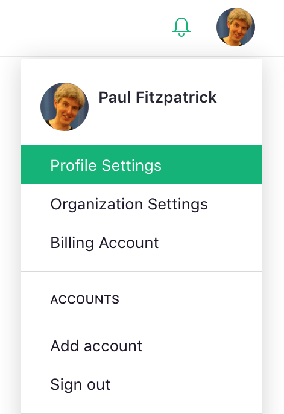

# Grist API

Grist has an API for manipulating documents, workspaces, and team sites.
To access this API, you'll need an API key.  An API key is owned by a single
user, and has the same permissions as that user.  To enable API access for
yourself, click on the circle with your profile picture or initial
on the top right of the screen.  Then select the "Profile Settings"
option.

**
{: .screenshot-half}

This shows a dialog with an "API key" section.


Click on the "Create" button to create an api key.


You can now copy this key for use when making API calls.  To be
clear, copy the key you get when clicking "Create", not the key
in the above screenshot, which isn't a real one.  You can
revoke your API key by clicking "Remove" from Profile Settings at any time.
You'll then have the option to create a new one if you wish.

To test your api key, try this from the command-line (substituting
your api key):
```sh
curl -H "Authorization: Bearer API-KEY-GOES-HERE" https://docs.getgrist.com/api/orgs
```

You should get a list of organizations (this is what the API calls team and personal sites).

Then you could, for example, change the name of your organization / site:

```sh
curl -H "Authorization: Bearer API-KEY-GOES-HERE" \
     -H "Content-Type: application/json" \
     localhost:8080/api/orgs/ORG-ID-GOES-HERE -X PATCH -d '{"name": "Omega Devices"}'
```

For details of the endpoints available, see our [API docs](api.md).

There are also client libraries available:

 * [JavaScript/TypeScript client library](https://www.npmjs.com/package/grist-api)
 * [Python client library](https://pypi.org/project/grist-api/)
