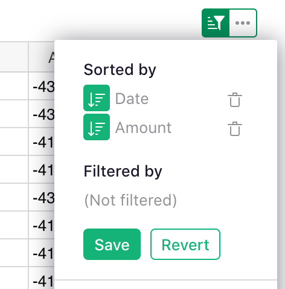
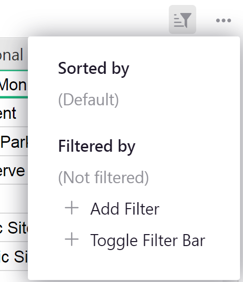
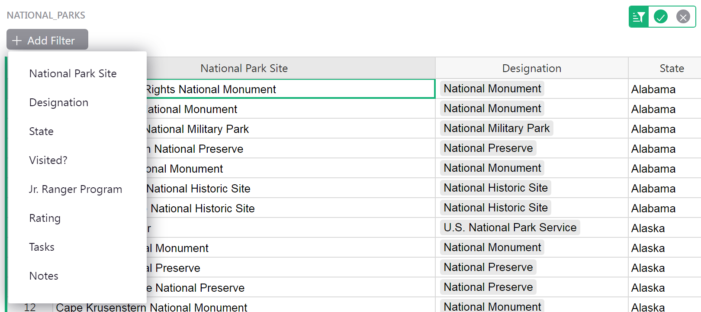

# Search, Sort, and Filter

Grist offers several ways to search within your data, or to organize data to be at your
fingertips.

## Searching

At the top of the document screen, you'll see a magnifying glass icon
()
which opens a spreadsheet-like search.

**
{: .screenshot-half }

You can also start searching using the keyboard shortcut
<code class="keys">*⌘* *F*</code> (Mac) or <code class="keys">*Ctrl* + *F*</code> (Windows).

As you type into the search textbox, Grist will move the cursor to the next cell containing your
search text. If there are no more matches in the current widget or page, the cursor will move to
the next widget or switch to the next page.

## Sorting

It's easy to find a word in a dictionary, but it wouldn't be if the words weren't sorted!
Grist offers flexible and convenient sorting options, which are quite different from a traditional
spreadsheet.

To sort a table in Grist by a column, open the menu from the column's header and select "Sort":

**
{: .screenshot-half }

In the same menu item, you can choose to sort in ascending or descending order.

**Difference from Excel**:
Importantly, sorting does not change any formula calculations, it only changes the order in which
you see the records. This is different from spreadsheets like Excel.

Another difference is that the sort setting is "active": if you add a record, or change a cell
that's used for sorting, the record will jump into its correct position in the sort order. See
[Saving Row Positions](#saving-row-positions) below for an option more similar to Excel's behavior.

### Multiple Columns
When a table is sorted, you can click another column to add it to the sort:

**
{: .screenshot-half }

The second column determines the order of records whose values in the first column are the same.
You can add more columns to the sort. For example, you could:

- Sort employees first by Department, then by Last Name, then by First Name.
- Sort transactions first by Date, then by Amount.
- Sort tasks first by 'Is Completed' column, then by Priority.

### Saving Sort Settings

Because sorting only affects your view of data, you can sort data in a Grist document even if you
do not have edit access to it. If you *can* write to a document, then you can also save sort
settings.

When you change sorting on a table, the icon on top of it gets highlighted in green. Click it to
see the currently active setting, as well as the options to manipulate them (e.g. remove a column
from the sort), to save the setting, or to revert your changes:

**
{: .screenshot-half }

When you save sort settings, they will apply to the widget any time this page is opened, either by
you or other collaborators.

**Multiple Views**:
Just like you can create multiple pages showing data from the same table, you can have different
sort settings on each view of the data. E.g. you could have one view showing credit card
transactions sorted by date, and another showing them sorted by amount.

### Sorting from Side Panel
You can sort widgets other than Table, such as Card List or Chart, using the "Sort & Filter"
subtab in the side panel:

**
{: .screenshot-half }

You can add one or more columns, and save or revert settings.

### Saving Row Positions

When you use the side panel, you'll notice one extra button: "Update Data". If you click it, the
current position of the records relative to each other is saved, and the active sort by your
selected columns is turned off.

In other words, rows will no longer jump into place according to values in certain columns, but
will remain in the place they are in. You will also be able to reorder rows manually by dragging
them.

## Filtering

You can choose to see only a subset of data in a table by filtering for certain values in a
column. Open the column menu from any column's header, and click "Filter Data". You'll see a
dialog listing the values in the column:

**
{: .screenshot-half }

Uncheck the values you don't want to see, or click "Select none" and then check only the values
you do want to see. The magnifying glass icon in the corner of the dialog lets you find values of
interest if the list is long.

Click "Apply" to apply your setting.

You can filter by more than one column. Only those rows will appear which match all of the
filters.

As with sorting, you can save filters to the view. Click the highlighted "Sort & Filter" icon on
top of the table:

**
{: .screenshot-half }

You'll see the columns for which there are active filters, and options to save the filter, or to
revert to saved settings.

As with sorting, you can create different widgets or pages showing the same table with different
filter settings. For example, you could have one page showing event attendees with status
"Confirmed" and another one showing those with status "Pending".

### Filter Buttons

Another way to apply filtering is through Filter Buttons. To use Filter Buttons, turn on the Filter Bar. 
Click the “Sort & Filter” icon on the top-right of the table then select “Toggle Filter Bar”.

**
{: .screenshot-half }

A grey “+ Add Filter” button will appear at the top-left of the table. When you select this button, 
a list of your columns will appear. 

**

This filtering works exactly like the filtering you saw at the beginning of the Filtering section, seen above. 
Select the column of data you want to filter by then uncheck the values you don’t want to see, or click “None” 
and check only the values you do want to see. There is a search bar at the top that allows you to find values 
of interest for longer lists.

Click “Apply” to apply your settings.  

After you have added your filters, be sure to click the green checkmark next to the “Search & Filter” icon to save.

**

With the Filter Bar on, you have buttons that you can use to more easily see and update your filters. If you toggle the Filter Bar to off, your filters will be saved but the buttons will no longer be visible.

**

### Complex Filters

To filter for more complex conditions, create a new formula column and filter this column for
values of "true".

For example, to filter for "Persons with salary over $100,000 or a position of 'Board Member'",
you can use a formula like this:

  `$Salary > 100000 or $Position == 'Board Member'`{: .formula }

This will produce a column of true and false values, which you can filter for the value `true`.
