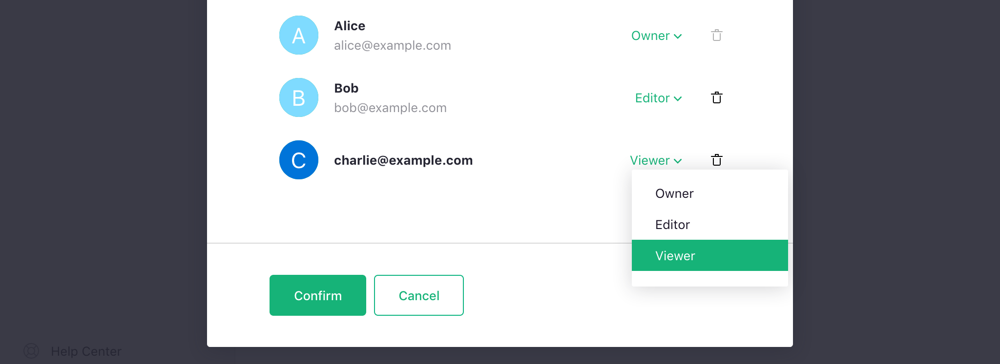

<iframe width="560" height="315" src="https://www.youtube.com/embed/vJpcC3-FHF8?rel=0" frameborder="0" allow="accelerometer; autoplay; encrypted-media; gyroscope; picture-in-picture" allowfullscreen></iframe>

## Sharing

To collaborate in Grist, you can invite other users to access a document. For team plans,
you can also add users to your team site, or to a workspace (see
[Team Sharing](team-sharing.md)).

When the document is open, click on the sharing icon
()
on the top right of the screen. It opens a menu with sharing and export
options. Select "Manage Users".

This option is also available in the Grist home page, when you click the three-dots icon to the right of a document's name.

If the "Manage Users" item is grayed out, it means you don't have permission to
view or manage the sharing settings for this document.

The sharing dialog that opens lists the users that have access to the
document. To add a user, enter that user's email address and hit "Enter" or click
"Invite new member" in the dropdown.

You may select a role for any invited user, and click "Confirm" to save the changes and send any invitations.

## Roles

There are three primary roles supported by Grist:

- **Viewer**: allows a user to view the document but not make any changes to
  it. Some operations like sorting and filtering will work without affecting
  other users of the document. This is the default role when you type in an email address.

- **Editor**: allows a user to view or make changes to the document data, structure, or formulas,
  but not to its sharing settings.

- **Owner**: gives a user complete permissions to the document, including to view and change its
  sharing settings. A document may have one or more owners. If you are able to open the
  "Manage Users" dialog, you have the "owner" role. You may not change your own
  access, but your access may be reduced or removed by another owner.

The option to inherit access does not affect individual plans, and is explained
in the [Team Sharing](teams#sharing.md) article.

## Public access

If you want to share your document with a wider audience, you can make it publicly accessible.
Open the share menu by clicking on the share icon 
() on top right of the
screen and selecting "Manage Users". Toggle the dropdown next to "Public Access" and select "On":

**

Once you click "confirm", anyone with the link to your document
will be able to view it. They will not be required to have a Grist login.

The "Copy Link" button is handy to copy the link to the clipboard for
pasting into an email, tweet, or anywhere else.

You can also allow anyone with the link to edit your document. Simply 
switch the role for Public Access to Editor.

**

Note that this allows **anyone** with the link to change
**absolutely anything** in your document, including deleting all the 
data. Should anything go wrong, you may recover previous versions of your 
document in the snapshots section of
[Document History.](./automatic-backups.md#examining-backups)

[Access rules](access-rules.md) may be combined with view-only link sharing, 
i.e. when the Public Access role is set to "Viewer." Read more about 
[Link Keys](../access-rules.md/#link-keys) to learn how to set rules that
limit which parts of your data users may see when accessing your document
via a particular link.

Access Rules do not support restricted link sharing when Public Access
is set to "Editor." Supporting access rules in this case, and others,
is on our [roadmap.](https://github.com/gristlabs/grist-core/issues/36)
