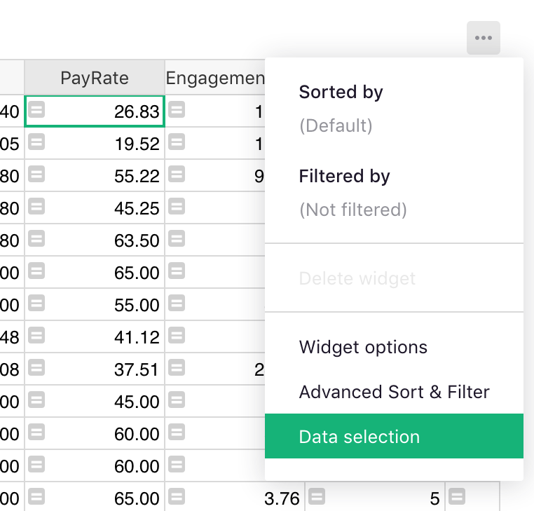
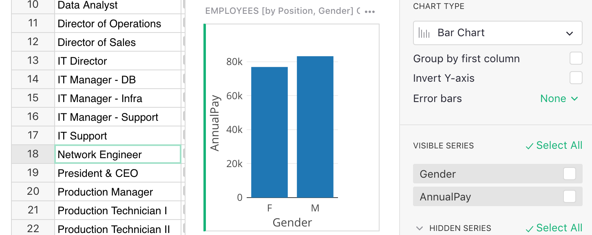

# Summary Tables

Summary tables are the workhorse of data analysis in Grist. They are similar to "pivot tables" in
spreadsheets, and to `GROUP BY` clauses in databases. They let you get table-wide totals or any
subtotals.

Summary tables have many uses:

  - Group projects by status, or by priority.
  - Summarize bank transactions by year, or quarter, or by category.
  - Group employees by position, or gender, or department.
  - Summarize by any combination, such as position *and* gender *and* department.
  - Group all records to calculate table-wide totals and statistics.

## Adding summaries

Click "Add New" button and select "Add Page" or "Add Widget to Page". In
the widget picker, click the summation icon
() next to the table you'd like
to summarize.

**
{: .screenshot-half }

When creating a summary table, you choose a field or a combination of fields by which data should
be grouped. These are called the "Group by" fields. The summary table will contain one row for
each group-by value. For instance, if "Position" is selected as a group-by field, the summary
table will contain one row for each job position.

Grist's powerful formulas then allow arbitrary calculations on the matching subsets of the
underlying data.

Keep in mind that the group-by fields determine *which* groups should exist in the summary table.
Do not select values you'd like to calculate (e.g. for average salary) as group-by fields; these will
be created using formulas in the next step.

!!! tip ""
    **Tip:** You can think of rows in a summary table as buckets into which your records will be
    placed. Group-by fields determine the labels for these buckets. For instance, a summary of
    projects grouped by status (e.g. "Active", "Completed", "NotStarted") will have three such
    buckets, one for each status. Every project goes into one of these three buckets. You can then
    easily calculate info for each folder, such as a count of projects or the total of their costs.

## Summary formulas

When you add a summary table, each of the selected group-by fields becomes a column in the new
table. *Everything* else in the summary table is calculated using formula columns. Some of these
columns are created automatically, as a convenience.

Specifically, a column `count` will be added to show the number of records in the group
represented by the current summary row. And for any numerical column in the original data, the
summary table will contain a same-named column with the total. For instance, the summary of
Employees grouped by Position would look like this:

**
{: .screenshot-half }

!!! tip ""
    **Tip:** A summary widget will have a header like "EMPLOYEES [by Position]", to
    indicate that it's showing summary data for the `Employees` table, grouped by "Position". You
    can click the title to rename it.

If you select a cell in a column like `count` or `AnnualPay` and hit <code
class="keys">*Enter*</code>, you'll see the formulas that calculate them:

  - `count` is `len($group)`
  - `AnnualPay` is `SUM($group.AnnualPay)`

The mysterious `$group` is simply another column, hidden by default (but you may unhide it). It contains for each cell the group of records represented by this summary row.

!!! tip ""
    **Side note for Python fans.**
    `$group` is a special Python object. It’s an iterable collection of records. Using an
    attribute like `$group.A` is a shorthand for the list of values in the `A` column of all the
    records in the group, similar to `[r.A for r in $group]`.

Sometimes the automatically created columns don't make sense. For instance, the sum of `PayRate`
isn't very meaningful. Simply delete such columns, either using the column menu or
using the <code class="keys">*Alt* + *Minus*</code> keyboard shortcut.

You are free to change formulas for the automatically created columns, or to add new formula
columns. Note that summary tables do not allow adding *non*-formula columns.

For instance, you might want to change the formula for `PayRate` from `SUM($group.PayRate)` to
`AVERAGE($group.PayRate)`, which would be a more interesting value.

**
{: .screenshot-half }

Here are some useful recipies of formulas in summary tables:

  - **Average**:  
    `AVERAGE($group.PayRate)` or `SUM($group.PayRate) / $count`
  - **Standard deviation**:  
    `STDEV($group.PayRate)`
  - **Maximum or minimum**:  
    `MAX($group.PayRate)`, `MIN($group.PayRate)`
  - **Sum over a subset of records**:  
    `SUM(r.AnnualPay for r in $group if r.EmploymentStatus == "Active")`
  - **Weighted average**:  
    `AVERAGE_WEIGHTED(zip($group.Life_Expectancy, $group.Population))`

In fact, you may use the full power of Python to calculate what you'd like. As for any table, your
formula may refer to any of the columns in the summary table, not only `$group`.

## Changing summary columns

The group-by columns in a summary table are created when you add the widget. It's not possible to
modify the values in them, or to modify their settings, such as type. The settings and values of
the group-by columns reflect those in the underlying table. When new values appear in the
underlying table for the group-by columns, the summary tables will also get new rows
automatically.

What you may change is which columns the table is grouped by. Click the three dots on the top
right of the summary table, and click "Data selection":

**
{: .screenshot-half }

The settings in the side pane tell you which data is shown and how it's grouped:

**
{: .screenshot-half }

You can click "Edit Data Selection" button to open the same widget picker that you used to add the
summary table. You can now deselect some "Group by" fields and select others, and click "Save" to
update the summary table.

## Linking summary tables

You can link summary tables to other widgets. If you have a summary table on a
page, it can be used as a selector for a table of underlying data, or for a more detailed summary.

For example, if you have a summary of `Employees` by "Position", it will be available as a "SELECT
BY" option when adding an unsummarized table of `Employees`:

**
{: .screenshot-half }

The result is that you can select a position in the summary table, and see all employees in that
position.

**
{: .screenshot-half }

You could similarly link a summary of `Employees` grouped by "Position" and "Gender" to the first widget:

**
{: .screenshot-half }

You can then select a position in the "Employees [by Position]" widget, and see a breakdown by
gender among the employees in that position.

**
{: .screenshot-half }

Note that such linking requires the new widget to include both "Position" *and* "Gender" in its
group-by columns.

For more about linking, see [Linking widgets](linking-widgets.md).

## Charting summarized data

Summary tables are a great source of data for charts, including dynamic charts. In the example
above, we could add another widget showing `Employees` grouped by "Position" and "Gender", but
this time in a Chart widget.

**
{: .screenshot-half }

Select "Bar Chart" for the chart type, and select "Gender" and "AnnualPay" as Visible Series. You
can now click on a position, and see visually the gender difference in average salary for this
position.

**
{: .screenshot-half }

The [Analyze and visualize](investment-research.md#dynamic-charts) tutorial shows other examples
of charts based on summary tables.

## Detaching summary tables

Summary tables are computed from underlying data. Sometimes, however, its useful to *"detach"* a
summary table and turn it into an independent data table.

For example, we've seen how to summarize a table of `Employees`, grouping it by the column
"Position". Let's say you want to associate some data with each position, such as a job
description, or a workers compensation insurance code. Such data belongs in its own table,
with one row for each position, and a few columns.

Summary tables provide an easy way to create such a table. Add a page with a summary of
`Employees` grouped by "Position".

**
{: .screenshot-half }

Now, in the right panel's "Data" tab, click the "Detach" button.

**
{: .screenshot-half }

Your summary table just got turned into a brand new table with the same rows and an auto-generated
name, like "Table1". You can rename it to "Positions", and add the columns you need:

**
{: .screenshot-half }

The calculated columns remain. In fact, anything you could calculate about each position in the
"Employees [by Position]" summary table, you may still calculate in the new "Positions" table.

One difference is that new values will not get added to the detached table automatically. In other
words, if a never-before-seen position (perhaps "Chief Troublemaker") appears in the underlying
data, a summary table would update automatically to include it, but a detached table will not.
