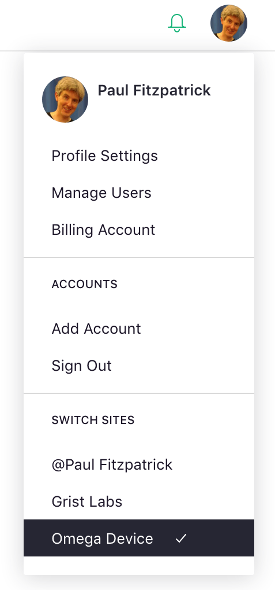

Teams
=========

Team sites are a paid feature which may have an unlimited number of documents. Team members can collaborate on documents stored in a team site, which can be further organized with [workspaces](workspaces.md) To use the features in this section, upgrade to a [team plan](https://www.getgrist.com/pricing).

If you have a team site but aren't seeing it, click in the top-left corner to open a drop-down menu of sites to which you have access.

**
{: .screenshot-half }

Opening the user menu under your profile icon will also list all sites to which you have access.

**
{: .screenshot-half }

Not seeing your team site?  Try selecting the "Add account" option in the user menu. It's possible the team site might be linked to a different email address.

A fresh team site will look something like this, ready to be filled with
Grist documents and shared with your team.

If a colleague has shared a team site with you, you'll see the same thing,
but depending on the [role](teams-sharing.md#Roles) they chose for you, some options may be inactive.  If you need those options,
ask your colleague to change your role.

For a team site you own,
you can [create documents](creating-doc.md), [create workspaces](workspaces.md),
or immediately start [sharing](teams-sharing.md) the site with others.

Understanding Personal Sites
-------------------------------
Sites that begin with the "@" symbol are personal sites, free to use for up to 10 docs. All Grist accounts have a personal site. Documents shared with you will go to your personal site and not count against the 10 document limit. Each document in a personal site may be [shared](sharing.md) with up to 2 people for free. The personal site itself cannot be shared. Lastly, personal sites do not have workspaces.

*a personal site*
{: .img-caption }

*a team site*
{: .img-caption }

Billing Account
-------------------------------

You may manage billing information, and edit your team site's team name and subdomain from the billing account page. Open the user menu and click on "Billing Account" to open a menu that looks like this. 

The original purchaser of the team site is the default billing manager. They may add other plan mamangers if they wish.