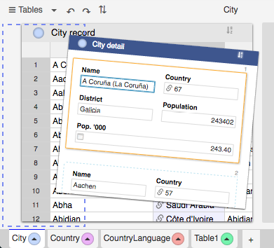

Configuring views
=================

A feature that separates Grist from traditional spreadsheets is that you can create multiple views
of the same data, and you can display multiple data sets on one screen. This allows you to create
complex dashboards and custom applications tailored to your needs.

Types of views
--------------
Similar to spreadsheet software, Grist lets you see your data in a grid of rows and columns. But you
can also choose to view your data as a **list** of records or as **detailed** records, one at a
time. Additional view types are listed below.

Consider your e-mail, for example. Your inbox lets you view your e-mails as a list, and opening an
e-mail displays its full details. It's a much nicer interface than having all your e-mails in a grid
in a spreadsheets, isn't it? Grist lets you do the same thing with your other data as well.

 <!-- For css styling via css/extra.css -->

Type    | Description
------- | -----------
Grid    | (**Default**) Standard grid or spreadsheet view type.
List    | List of records. Layout of each record is fully customizable.
Detail  | Full-page detail record, with next / previous navigation. Layout of each record is fully customizable.
Summary | A summary (aka pivot) table of an existing table.
Chart   | A chart view type that can be configured to display line charts, bar charts, and many more.

Creating a new view
-------------------
To create a new view for an existing table, click ``Add section``. In the added blank section you
can select the table and the view type.

Organizing view sections
------------------------
To rearrange view sections on the screen you can simply grab a section by its top-left corner and
drag it to the desired location. Drop zones are signified by a dotted blue line.

