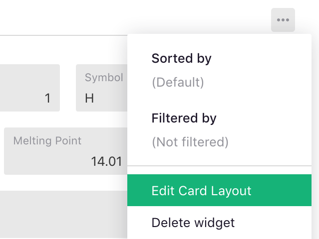

# Page widget: Card &amp; Card List {: data-toc-label='Page widget: Card' }

The **Card** and **Card List** widgets allow viewing data as a form or a record, similar to how data
is commonly presented in a custom application. In Grist, you can choose what fields
to show and how to lay them out.

A **Card List** shows a scrollable list of cards. A **Card** shows one at a time. A single
**Card** is most useful when linked to
another Table widget (see [Linking widgets](linking-widgets.md)). It can then show the details of
the selected record. The single Card widget may also be used on its own. In this case, you'll see
navigation buttons on top to move to the next or previous record, or to add a new one.

  **
  {: .screenshot-half }

## Selecting theme

The widget options panel allows choosing the theme, or style, for the card:

  **
  {: .screenshot-half }

## Editing card layout
To configure the layout of a card, click the green "Edit Card Layout" button below the theme
selector, or click the three dots on top right of the widget and select "Edit Card Layout" in the
menu.

  **
  {: .screenshot-half }

  **
  {: .screenshot-half }

While the layout editor is active, you'll see a single record with boxes overlaid on top of each
field, and a set of buttons on top of the widget.

  **
  {: .screenshot-half }

#### Resizing a field
To resize a field, move the mouse to a vertical border separating two fields, and drag
the border. Only the width of fields may be changed, while the height changes dynamically to fit
the field contents.

  **
  {: .screenshot-half }

#### Moving a field
To move a field, hold down the mouse button on a field and drag it. As you move the mouse
near the edges of other fields, you will notice boxes with dashed borders indicating possible drop points in
relation to other fields. Release the mouse over one of these boxes to place your field into the desired
location.

  **
  {: .screenshot-half }

#### Deleting a field
To delete a field, move the mouse over it. An "x" icon will appear. Click this icon to remove the
field. This is similar to hiding a column: this operation does not delete the underlying data.

  **
  {: .screenshot-half }

You can also delete a field by hiding it in in the "Visible Fields" list in the side panel, as described in
[Configuring field list](page-widgets.md#configuring-field-lists). This is available even when the
layout editor is not active.

#### Adding a field
To add a field, click the "Add Field" button on top of the layout editor. In the dropdown menu,
select "Create New Field" to create a new column of data, or one of the existing fields in the
table that are not currently shown in the card.

  **
  {: .screenshot-half }

When you click the field, it will be added at the bottom of the layout. You can then move it or
resize it as described above. Any new fields you create will only be added to the data when you
save the layout.

You can also add an existing field by making it visible using the "Hidden Fields" list in the side
panel, as described in [Configuring field list](page-widgets.md#configuring-field-lists). This is
available even when the layout editor is not active.

#### Saving the layout

When done editing the layout, remember to click "Save Layout" on top of the widget, or "Cancel" to
revert your changes.

Once saved, the Card or Card List widget will update to show all cards in the updated layout.
