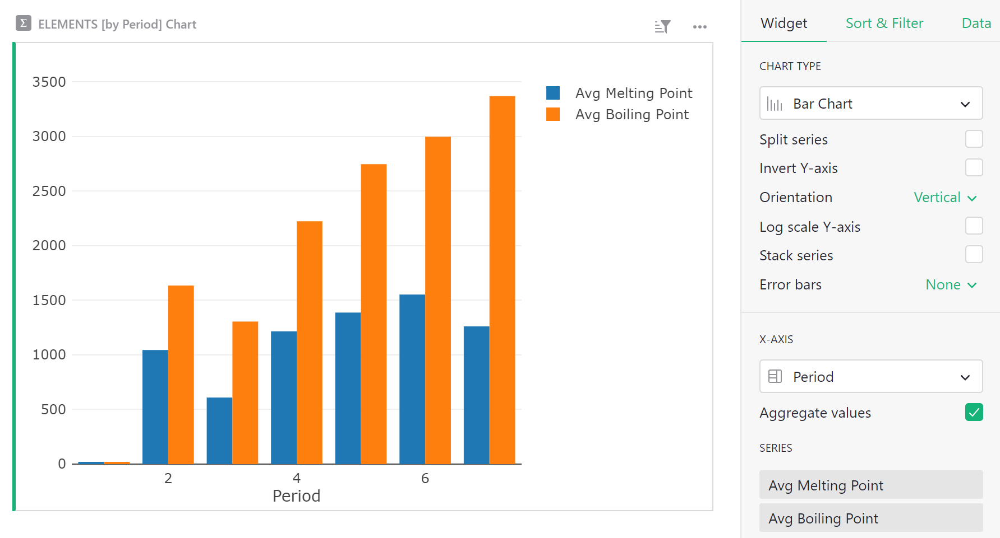
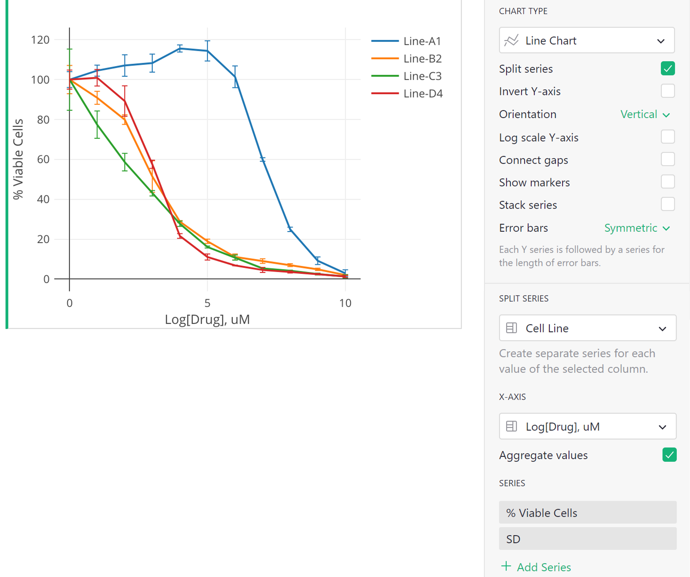

# Page widget: Chart

Grist supports several chart types to help you visualize your data easily. Charts may be used to plot a
regular table of data, a linked widget (as described in [Linking widgets](linking-widgets.md)), or
a summary table (as described in [Summary tables](summary-tables.md)).

The most common chart types are illustrated here:

## Chart types

Each chart type plots several data series. Select the series to plot along the X-axis then choose to plot any other series by 
clicking the green 'Add Series' text in the [creator panel](glossary.md#creator-panel). If adding more than one series, the 
order of the list matters and determines how each series is used, as described below.

#### Bar Chart

Needs two or more series: the first for bar labels (x-axis), the second for bar heights (y-axis). Additional series create 
additional bars at each data point and specify their heights.

  **
  {: .screenshot-half }

#### Line Chart

Needs two or more series: the first series is for the X values, the second is for Y values to create the line.
Additional series specify Y values for additional lines.

  **
  {: .screenshot-half }

#### Pie Chart

Needs two series: the first for the pie slice labels, the second for the pie slice sizes.

  **
  {: .screenshot-half }

#### Area Chart

Similar to a line chart, needs two or more series: the first for the X values, the second for
the Y values to create the line. Additional series specify Y values for additional
lines.

  **
  {: .screenshot-half }

#### Scatter Plot

Needs three or more series: the first for the point labels, and the second and third for the X and
Y values for each point, respectively. Additional series specify Y values for additional sets of
points.

  **
  {: .screenshot-half }

#### Kaplan-Meier Plot

The [Kaplan-Meier Plot](https://en.wikipedia.org/wiki/Kaplan%E2%80%93Meier_estimator) is useful
for certain studies, and needs two series: the first for the label of the line to which a point
belongs, the second giving a survival time or time-to-failure of that point. The plot shows the
survival times on the X axis, and the number of points that survive at that time on the Y axis.

  **
  {: .screenshot-half }

## Chart options

A number of chart options are available, some of them specific to certain chart types.

**Split Series**: When checked, an extra series is to be selected under the 'Split Series' dropdown. The series
should contain a group label for each data point. All points with the same group value are plotted as a separate line.

For example:

  **
  {: .screenshot-half }

**Invert Y-axis**: When checked the Y axis is flipped, with smaller values above and larger values
below.

**Connect gaps** [for Line Charts only]: When checked, gaps caused by missing values are connected
by connecting neighboring points. The "Show Markers" option described next can be used to
keep a visual cue for which points are present.

**Show markers** [for Line Charts only]: When checked, each point on the line is marked
additionally by a small circle. See the example for "Group by first column" above.

**Error bars** [for Line and Bar Charts]: When set to "Symmetric", each Y series should be
followed by a series for the length of the error bars to show. When set to "Above+Below", each Y
series should be followed by *two* series, one for the top error bars, and one for the bottom.

  **
  {: .screenshot-half }

In the example here, "Split Series" is checked. So the series selected from the Split Series dropdown ("Cell Line"), specifies how to group the data into lines. 
The series selected under the X-Axis dropdown ("Log[Drug], uM"), specifies our values along the x-axis. Our first series in the Series list ("% Viable Cells"), specifies our y-axis values, and the series that follows that ("SD"), specifies the error bars for those Y values.
